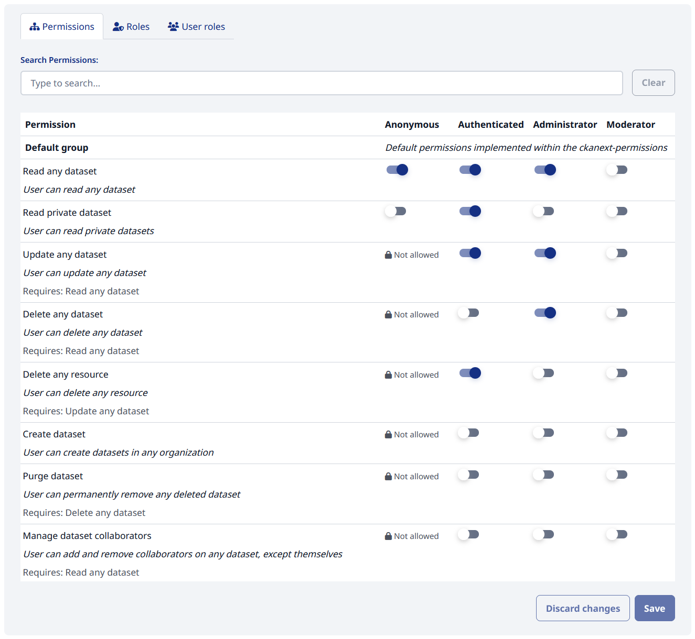
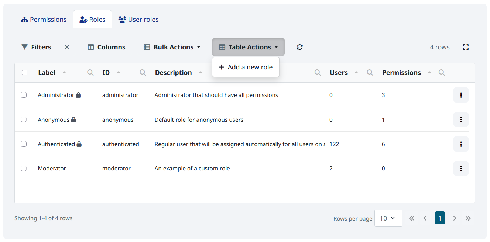
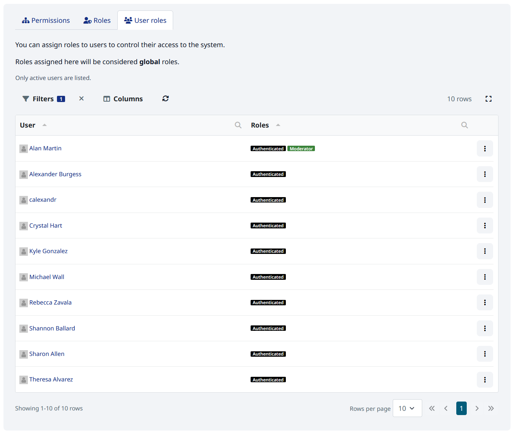

[](https://github.com/DataShades/ckanext-permissions/actions/workflows/test.yml)

# ckanext-permissions

> [!WARNING]
> This extension is still under development and not ready for production use.

The extension allows you to build a Access Control List (ACL) system within CKAN.




### Roles

The extension has a 3 default roles: `anonymous`, `authenticated` and `administrator`. And allows you to define custom roles.



### Assigning roles to users

The extension provides a way to assign roles to users. Roles could be global and scoped to an organization.



### Default permissions

| Permission             | Grants                                   | Requires             |
| ---------------------- | ---------------------------------------- | -------------------- |
| `read_any_dataset`     | View any dataset, including private ones |                      |
| `read_private_dataset` | View private datasets                    |                      |
| `update_any_dataset`   | Edit any dataset                         | `read_any_dataset`   |
| `delete_any_dataset`   | Delete any dataset                       | `read_any_dataset`   |
| `delete_any_resource`  | Delete any resource                      | `update_any_dataset` |

A role can only be given a permission if it also has the permissions it requires, because CKAN needs them to carry out the action: editing and deleting a dataset in the UI first load it as the user, and deleting a resource is saved as an update of its dataset.

A permission granted through a global role applies to every dataset. Through a role scoped to an organization, it applies only to that organization's datasets. The permissions add access on top of CKAN's own rules; they never take it away.

> [!CAUTION]
> Permissions given to the `anonymous` role apply to everyone, including visitors who are not logged in. Giving it `update_any_dataset`, `delete_any_dataset` or `delete_any_resource` lets anyone edit or delete every dataset.


## Requirements

Compatibility with core CKAN versions:

| CKAN version    | Compatible?   |
| --------------- | ------------- |
| 2.9 and earlier | no            |
| 2.10+           | yes           |
| 2.11+           | yes           |
| 2.12+           | yes           |


## Installation

Using GIT Clone:

1. Activate your CKAN virtual environment, for example:
   ```bash
   . /usr/lib/ckan/default/bin/activate
   ```

2. Clone the source and install it on the virtualenv:
   ```bash
   git clone https://github.com/DataShades/ckanext-permissions.git
   cd ckanext-permissions
   pip install -e .
   ```

3. Add `permissions permissions_manager` to the `ckan.plugins` setting in your CKAN config file (by default the config file is located at `/etc/ckan/default/ckan.ini`).

4. Initialize DB tables:
   ```bash
   ckan -c /etc/ckan/default/ckan.ini db upgrade -p permissions
   ```

5. Initialize default Roles and add Authenticated default role to all existing Users:
   ```bash
   ckan -c /etc/ckan/default/ckan.ini permissions assign-default-user-roles
   ```

6. Rebuild the search index, so that existing datasets get the permission labels used to filter search results. Without this, users granted `read_any_dataset` or `read_private_dataset` can open those datasets but won't find them in search:
   ```bash
   ckan -c /etc/ckan/default/ckan.ini search-index rebuild
   ```

7. Restart CKAN. For example:
   ```bash
   sudo supervisorctl restart ckan-uwsgi
   ```


## Config settings

```ini
# Permission group files to load, as `<module>:<path relative to the module>`.
# Separate multiple files with spaces or new lines.
# (optional, default: ckanext.permissions:default_group.yaml)
ckanext.permissions.permission_groups =
    ckanext.permissions:default_group.yaml
    ckanext.myext:permissions.yaml
```

Setting this option replaces the default list, so include `ckanext.permissions:default_group.yaml` to keep the default permissions. A file whose module can't be imported or whose path doesn't exist is skipped silently.

### Permission group format

Each file defines one group of permissions, shown as a section on the permissions page:

```yaml
name: My extension
description: Permissions for my extension
permissions:
  - key: review_dataset
    label: Review dataset

  - key: approve_dataset
    label: Approve dataset
    description: User can approve datasets  # optional
    depends_on:  # optional
      - review_dataset
```

`name`, `description` and at least one permission are required, and every permission needs a `key` and a `label`. Keys must be unique across all loaded groups. Invalid groups stop CKAN from starting.

`depends_on` lists permissions a role must have before it can be given this one; they can come from any loaded group. Saving the permissions page fails if a role would end up with a permission but not its dependencies, including when a dependency is removed while the permission is kept. On the page, ticking a permission also ticks its dependencies for that role, and unticking a dependency unticks the permissions that need it. The rule applies when permissions are saved, so grants made before a dependency was added keep working until they're edited.

Use `depends_on` only when a permission can't work without another one, not to express that one permission is broader than another. List direct requirements only; they're followed in a chain, so `delete_any_resource` requires `update_any_dataset`, which in turn requires `read_any_dataset`.

Your extension checks its own permissions with `ckanext.permissions.utils.check_permission(key, user)`, or `check_package_permission(key, user, package)` to include roles scoped to the dataset's organization.


## CLI

```bash
# Create the default roles (anonymous, authenticated, administrator) if they are missing
ckan -c /etc/ckan/default/ckan.ini permissions init-default-roles

# Create the default roles, then give ROLE (default: authenticated) to every active user
ckan -c /etc/ckan/default/ckan.ini permissions assign-default-user-roles [ROLE]

# Remove the global ROLE (default: authenticated) from the given users, or from all users
ckan -c /etc/ckan/default/ckan.ini permissions remove-role-from-users [ROLE] [-u USER_ID ...]
```


## Tests

To run the tests, do:

    pytest --ckan-ini=test.ini --cov=ckanext.permissions


## License

[AGPL](https://www.gnu.org/licenses/agpl-3.0.en.html)
