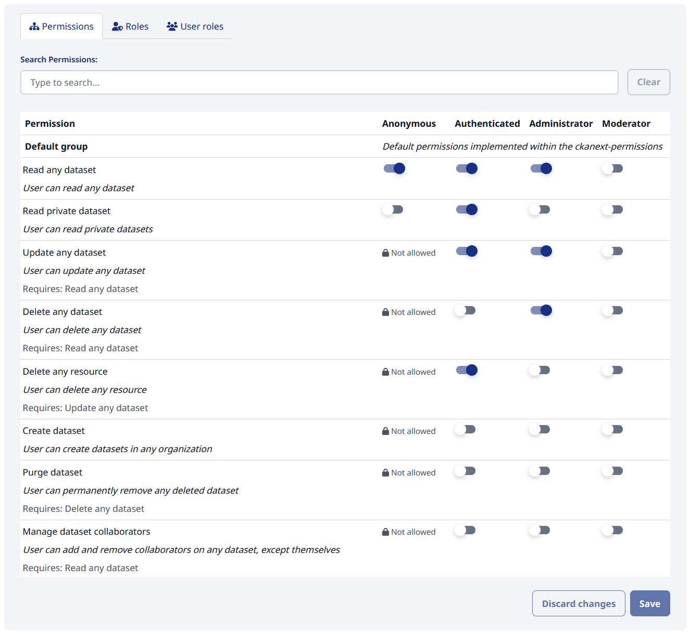
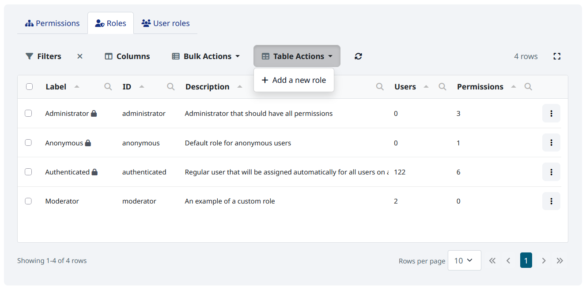
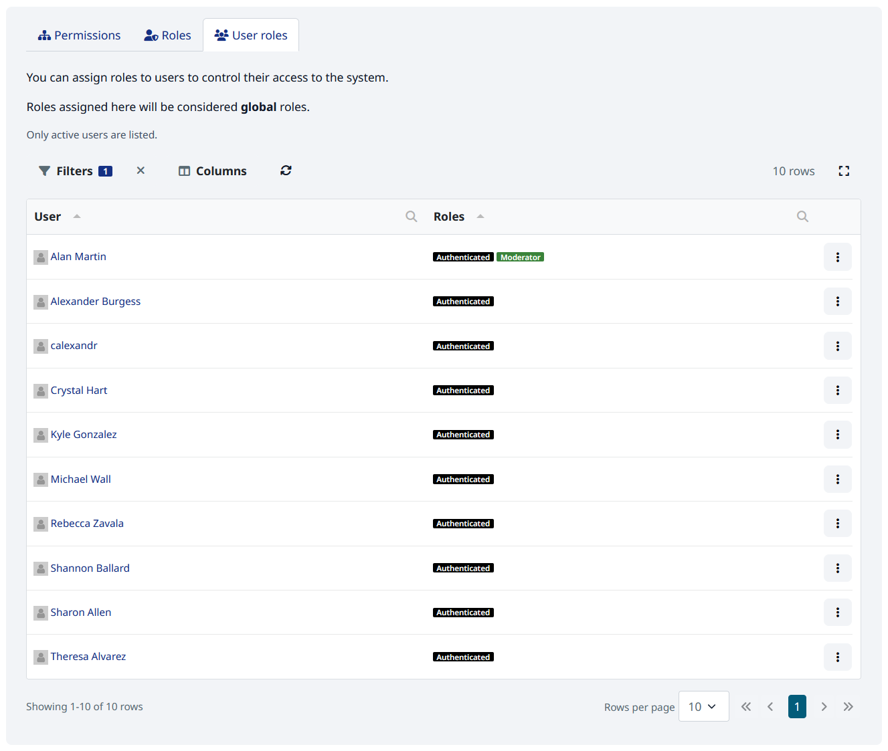

[](https://github.com/DataShades/ckanext-permissions/actions/workflows/test.yml)

# ckanext-permissions

> [!WARNING]
> This extension is still under development and not ready for production use.

The extension allows you to build a Access Control List (ACL) system within CKAN.




### Roles

The extension has 3 default roles: `anonymous`, `authenticated` and `administrator`, and allows you to define custom roles.

`anonymous` and `authenticated` are implicit: they aren't assigned to users. Permissions given to `anonymous` apply to everyone, and permissions given to `authenticated` apply to every logged-in user. `administrator` and custom roles apply only to the users they're assigned to. To keep a permission from some logged-in users, give it to a custom role instead of `authenticated`.



### Assigning roles to users

The extension provides a way to assign roles to users. Roles could be global and scoped to an organization.



### Default permissions

| Permission                     | Grants                                                                        | Requires                                   |
| ------------------------------ | ----------------------------------------------------------------------------- | ------------------------------------------ |
| `read_any_dataset`             | View any dataset, including private ones                                      |                                            |
| `read_private_dataset`         | View private datasets                                                         |                                            |
| `update_any_dataset`           | Edit any dataset                                                              | `read_any_dataset`                         |
| `delete_any_dataset`           | Delete any dataset                                                            | `read_any_dataset`                         |
| `delete_any_resource`          | Delete any resource                                                           | `update_any_dataset`                       |
| `create_dataset`               | Create datasets in any organization                                           |                                            |
| `purge_dataset`                | Permanently remove deleted datasets (API only)                                | `delete_any_dataset`                       |
| `manage_dataset_collaborators` | Add and remove dataset collaborators, except themselves                       | `read_any_dataset`                         |
| `bulk_update_datasets`         | Make public, make private or delete datasets in bulk on the organization page | `update_any_dataset`, `delete_any_dataset` |
| `manage_organization_members`  | Add, change and remove organization members, except admins and themselves     |                                            |
| `create_organization`          | Create organizations, becoming their admin                                    |                                            |
| `create_group`                 | Create groups, becoming their admin                                           |                                            |
| `manage_any_group`             | Edit any group, manage its members and add or remove its datasets             |                                            |

A role can only be given a permission if it also has the permissions it requires. Most requirements exist because CKAN needs them to carry out the action: editing and deleting a dataset in the UI first load it as the user, and deleting a resource is saved as an update of its dataset. `purge_dataset` and `bulk_update_datasets` require the permissions whose effect they include, so a role can't bulk-delete or purge datasets it can't delete one by one.

A permission granted through a global role applies to every dataset. Through a role scoped to an organization, it applies only to that organization's datasets. `create_organization`, `create_group` and `manage_any_group` don't belong to an organization, so they only work through a global role. `create_organization` and `create_group` only matter when `ckan.auth.user_create_organizations` or `ckan.auth.user_create_groups` is off; otherwise every logged-in user can already create them. CKAN turns `user_create_groups` on by default. The permissions add access on top of CKAN's own rules; they never take it away.

To stop users from raising their own access, `manage_dataset_collaborators` can't add the user themselves as a collaborator, and `manage_organization_members` can't change the user's own membership, grant the `admin` role, or change or remove an existing admin.

> [!NOTE]
> Permissions given to the `anonymous` role apply to everyone, including visitors who are not logged in. Only `read_any_dataset` and `read_private_dataset` can be given to it; the others are disabled in its column on the permissions page.

> [!NOTE]
> CKAN gives a chain of auth functions the anonymous access flag of the function chained last. A plugin that chains `package_show`, `package_create` or `package_update` after `permissions` must keep `@tk.auth_allow_anonymous_access` on its function, or permissions given to the `anonymous` role stop working for visitors who aren't logged in.


## Requirements

Compatibility with core CKAN versions:

| CKAN version     | Compatible?   |
| ---------------- | ------------- |
| 2.10 and earlier | no            |
| 2.11+            | yes           |
| 2.12+            | yes           |


## Installation

Using GIT Clone:

1. Activate your CKAN virtual environment, for example:
   ```bash
   . /usr/lib/ckan/default/bin/activate
   ```

2. Clone the source and install it on the virtualenv:
   ```bash
   git clone https://github.com/DataShades/ckanext-permissions.git
   cd ckanext-permissions
   pip install -e .
   ```

3. Add `permissions permissions_manager tables` to the `ckan.plugins` setting in your CKAN config file (by default the config file is located at `/etc/ckan/default/ckan.ini`). The permission manager renders its Roles and User roles lists with [ckanext-tables](https://github.com/DataShades/ckanext-tables), which is installed as a dependency.

   > [!WARNING]
   > `permissions` implements `IPermissionLabels`, and CKAN uses only the first enabled plugin that implements it. If another plugin also implements it, whichever comes first in `ckan.plugins` wins and the other's labels are ignored. When `permissions` loses, users granted `read_any_dataset` or `read_private_dataset` won't find private datasets in search. To combine both, write a plugin that subclasses `ckanext.permissions.implementation.permission_labels.PermissionLabels`, merges the other plugin's labels into its results, and is listed first.

4. Create the DB tables and the default roles:
   ```bash
   ckan -c /etc/ckan/default/ckan.ini db upgrade -p permissions
   ```

5. Rebuild the search index, so that existing datasets get the permission labels used to filter search results. Without this, users granted `read_any_dataset` or `read_private_dataset` can open those datasets but won't find them in search:
   ```bash
   ckan -c /etc/ckan/default/ckan.ini search-index rebuild
   ```

6. Restart CKAN. For example:
   ```bash
   sudo supervisorctl restart ckan-uwsgi
   ```


## Config settings

```ini
# Permission group files to load, as `<module>:<path relative to the module>`.
# Separate multiple files with spaces or new lines.
# (optional, default: ckanext.permissions:default_group.yaml)
ckanext.permissions.permission_groups =
    ckanext.permissions:default_group.yaml
    ckanext.myext:permissions.yaml
```

Setting this option replaces the default list, so include `ckanext.permissions:default_group.yaml` to keep the default permissions. A file whose module can't be imported or whose path doesn't exist is skipped silently. Grants of a permission that no loaded file defines any more stay in the database but have no effect; the permissions page shows how many there are, and `ckan permissions orphans` lists or deletes them.

### Permission group format

Each file defines one group of permissions, shown as a section on the permissions page:

```yaml
name: My extension
description: Permissions for my extension
permissions:
  - key: review_dataset
    label: Review dataset

  - key: approve_dataset
    label: Approve dataset
    description: User can approve datasets  # optional
    anonymous: false  # optional, default: true
    depends_on:  # optional
      - review_dataset
```

`name`, `description` and at least one permission are required, and every permission needs a `key` and a `label`. Keys must be unique across all loaded groups. Invalid groups stop CKAN from starting. A dependency on a permission that no loaded group defines, for example after its file is removed from the config, is ignored with a warning in the log.

`depends_on` lists permissions a role must have before it can be given this one; they can come from any loaded group. Saving the permissions page fails if a role would end up with a permission but not its dependencies, including when a dependency is removed while the permission is kept. On the page, ticking a permission also ticks its dependencies for that role, and unticking a dependency unticks the permissions that need it. The rule applies when permissions are saved, so grants made before a dependency was added keep working until they're edited.

Set `anonymous: false` on permissions that must never reach visitors who aren't logged in, such as anything that changes data. Saving the permissions page fails if such a permission is given to the `anonymous` role, and a grant that already exists is ignored. A permission allowed for the `anonymous` role can't depend on one that isn't.

Use `depends_on` only when a permission can't work without another one, not to express that one permission is broader than another. List direct requirements only; they're followed in a chain, so `delete_any_resource` requires `update_any_dataset`, which in turn requires `read_any_dataset`.

### Checking permissions in your extension

Once your group is loaded, check its permissions with `ckanext.permissions.utils.check_permission`:

```python
check_permission(key, user)  # global roles only
check_permission(key, user, scope, scope_id)  # global roles, or roles assigned in that scope
```

It returns `True` if one of those roles has the permission. `user` is a `model.User` or `model.AnonymousUser` object, not a name or ID. The grants of the implicit `anonymous` and `authenticated` roles count as global. Roles can currently be assigned only in the organization scope, so `scope` is `ckanext.permissions.const.SCOPE_ORGANIZATION` and `scope_id` an organization ID. Without `scope` or `scope_id`, for example for a dataset without an organization, only global roles are checked.

Pass the scope whenever the object belongs to an organization. Without it, roles scoped to organizations are ignored, so a user who has the permission only in the dataset's organization would be refused. For a dataset, pass its `owner_org`.

The usual place for the check is an auth function. This one decides who can approve a dataset:

```python
import ckan.plugins as p
import ckan.plugins.toolkit as tk
from ckan import model, types

import ckanext.permissions.const as perm_const
import ckanext.permissions.utils as perm_utils


def approve_dataset(context: types.Context, data_dict: types.DataDict) -> types.AuthResult:
    user = model.User.get(context.get("user")) or model.AnonymousUser()
    package = model.Package.get(data_dict.get("id"))
    owner_org = package.owner_org if package else None

    return {"success": perm_utils.check_permission("approve_dataset", user, perm_const.SCOPE_ORGANIZATION, owner_org)}


class MyExtPlugin(p.SingletonPlugin):
    p.implements(p.IAuthFunctions)

    def get_auth_functions(self):
        return {"approve_dataset": approve_dataset}
```

Your action then calls `tk.check_access("approve_dataset", context, data_dict)`, and templates call `h.check_access("approve_dataset", {"id": pkg.id})` to decide whether to show the button. The extension doesn't provide a template helper that checks a permission directly.

To give a permission extra access to a core action rather than a new one, chain the core auth function and fall back to it when the check fails:

```python
@tk.auth_allow_anonymous_access
@tk.chained_auth_function
def package_update(next_, context, data_dict):
    user = model.User.get(context.get("user")) or model.AnonymousUser()
    package = model.Package.get(data_dict.get("id"))
    owner_org = package.owner_org if package else None

    if perm_utils.check_permission("review_dataset", user, perm_const.SCOPE_ORGANIZATION, owner_org):
        return {"success": True}

    return next_(context, data_dict)
```

For a permission that doesn't belong to an organization, such as creating something site-wide, leave out the scope.

> [!WARNING]
> A key that no loaded group defines is never granted: the check returns `False` without an error. A typo in the key, or a group file missing from `ckanext.permissions.permission_groups`, looks like the user lacks the permission.


## CLI

```bash
# List role grants of permissions that no loaded permission group defines, or delete them
ckan -c /etc/ckan/default/ckan.ini permissions orphans [--delete]

# Write the permissions of every role as JSON to a file, or to stdout
ckan -c /etc/ckan/default/ckan.ini permissions export [FILE]

# Give each role in the file, or stdin, exactly the permissions listed for it
ckan -c /etc/ckan/default/ckan.ini permissions import [FILE] [--dry-run]

# Delete change log entries older than the given number of days
ckan -c /etc/ckan/default/ckan.ini permissions changes prune --older-than DAYS [--dry-run]
```


## Moving permissions between portals

To copy permissions from one portal to another, for example from UAT to production, export them on the source and import them on the target. On the permissions page, **Export** shows the saved permissions as JSON to copy or download. **Import** takes that JSON and changes the switches on the page, so you can review the highlighted changes before you save them. The `permissions export` and `permissions import` commands do the same from the command line, and the `permissions_export` API action returns the export.

```json
{
  "version": 1,
  "roles": {
    "authenticated": ["create_dataset"],
    "data_steward": ["manage_dataset_collaborators", "read_any_dataset"]
  }
}
```

Each role in the export gets exactly the permissions listed for it: missing permissions are revoked. Roles that aren't in the export keep their permissions. The import skips and reports these entries:
- roles that don't exist on the target; create them first on the Roles tab
- permissions that no loaded permission group defines
- permissions the role can't be given, such as `update_any_dataset` for `anonymous`

The export contains only the permissions of each role. It doesn't include the roles' labels and descriptions, or the roles assigned to users.


## Tests

To run the tests, do:

    pytest --ckan-ini=test.ini --cov=ckanext.permissions


## License

[AGPL](https://www.gnu.org/licenses/agpl-3.0.en.html)
