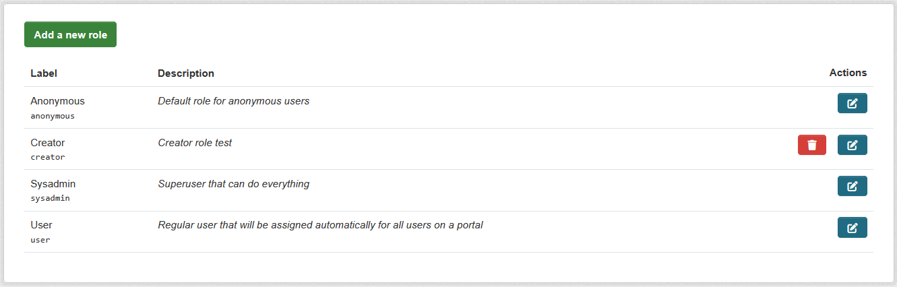

# ckanext-permissions

> [!WARNING]
> This extension is still under development and not ready for production use.

The extension allows you to build a Access Control List (ACL) system within CKAN.

### Roles

The extension has a 3 default roles: `anonymous`, `user` and `sysadmin`. And allows you to define custom roles.

### Assigning roles to users

The extension provides a way to assign roles to users. Roles could be global and scoped to an organization.

## Requirements

Compatibility with core CKAN versions:

| CKAN version    | Compatible?   |
| --------------- | ------------- |
| 2.9 and earlier | no            |
| 2.10+           | yes           |

## Installation

Install it from `pypi` (TBD) or from source if you know what you are doing. Refer to CKAN
[documentation](https://docs.ckan.org/en/latest/extensions/tutorial.html#installing-the-extension) to know, how to install extension from source.

## Config settings

TBD

## Tests

To run the tests, do:

    pytest --ckan-ini=test.ini --cov=ckanext.permissions

## License

[AGPL](https://www.gnu.org/licenses/agpl-3.0.en.html)
